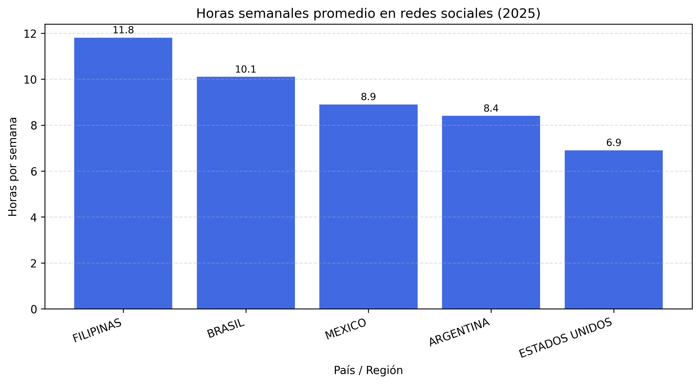
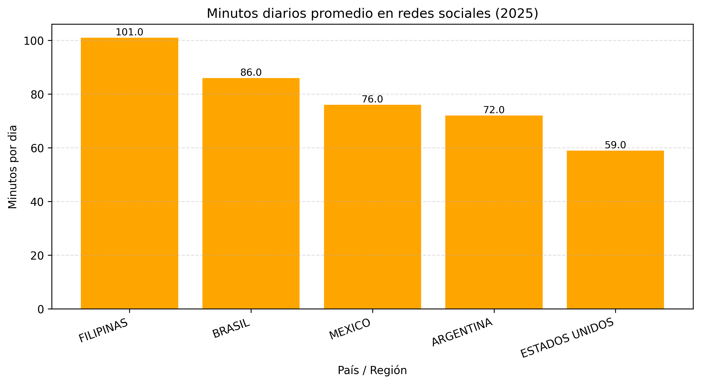
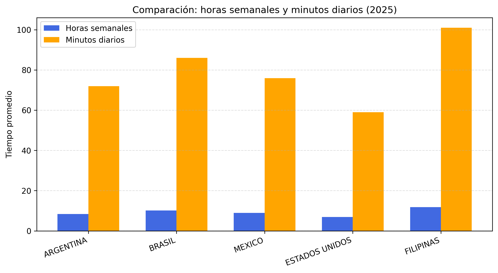
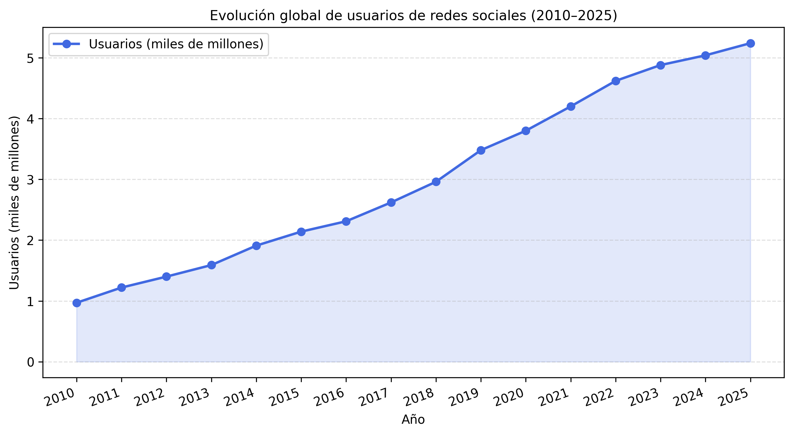

# 📊 Análisis visual de la evolución del uso de redes sociales (2010–2025)

## 🔹 Tendencia general
La curva es **creciente**. Desde el inicio del análisis en 2010, se observa un aumento sostenido en el número de usuarios de redes sociales.  
No hay retrocesos marcados: la dirección siempre es ascendente.

## 🔹 Patrón del crecimiento
El crecimiento parece ser **lineal**. Aunque hay años en los que el incremento fue mayor o menor, en general la pendiente se mantiene estable.  
Se podría decir que el despegue fue inmediato, ya que desde 2010 se viene dando un aumento constante.

## 🔹 Posibles aceleraciones
No se identifican puntos claros donde la curva se dispare bruscamente.  
Si bien existen pequeños baches o desaceleraciones, no representan caídas ni deterioro real en el crecimiento.

## 🔹 Meseta o saturación
No hay evidencia de una meseta.  
El crecimiento continúa hasta 2025, lo que sugiere que aún hay margen de expansión en el uso global de redes sociales.

---

## 🌍 Análisis de uso promedio de redes sociales por país (2025)

**Gráfico:**  


**Fuente:** DataReportal 2025

### Resumen:
El gráfico muestra el promedio de horas semanales dedicadas al uso de redes sociales por país.  
- Filipinas presenta la mayor dedicación (**11.8 horas**), seguida por **Brasil (10.1)** y **México (8.9)**.  
- **Argentina** registra un uso intermedio (**8.4 horas**), mientras que **Estados Unidos** muestra el valor más bajo (**6.9 horas**).

### Interpretación:
Las diferencias entre los países sugieren variaciones **culturales y socioeconómicas** en la adopción y dependencia de las redes.  
En regiones como el Sudeste Asiático y Latinoamérica, el uso intensivo podría asociarse con **mayor penetración móvil y hábitos de conexión más prolongados**.  
El patrón general confirma que el tiempo de exposición a redes sociales continúa en aumento.

---

## ⏱️ Análisis de uso promedio diario en redes sociales por país (2025)

**Gráfico:**  


**Fuente:** DataReportal 2025

### Resumen:
El gráfico presenta el promedio de minutos diarios dedicados al uso de redes sociales por país.  
- **Filipinas** encabeza la lista con **101 minutos diarios**.  
- Le siguen **Brasil (86 min)** y **México (76 min)**.  
- **Argentina** registra un promedio de **72 minutos**, mientras que **Estados Unidos** tiene el valor más bajo (**59 minutos diarios**).

### Interpretación:
Las diferencias reflejan **variaciones culturales y hábitos digitales**.  
El Sudeste Asiático y Latinoamérica muestran un uso intensivo, mientras que en Norteamérica los promedios más bajos pueden relacionarse con un uso más fragmentado o laboral.  
En conjunto, los datos confirman un **alto nivel de exposición diaria** a redes sociales.

---

## ⚖️ Análisis comparativo: horas semanales vs minutos diarios (2025)

**Gráfico:**  


**Fuente:** DataReportal 2025

### Descripción general:
El gráfico compara el promedio de horas semanales y minutos diarios dedicados al uso de redes sociales en los países analizados.  
La tendencia muestra una correspondencia consistente: los países con mayor cantidad de minutos diarios también presentan un número más alto de horas semanales.

### Observaciones destacadas:
- **Filipinas** mantiene el valor más alto en ambas métricas.  
- **Brasil** muestra una dedicación elevada, superando la media global.  
- **México** y **Argentina** presentan valores intermedios.  
- **Estados Unidos** vuelve a ser el país con menor dedicación.

### Interpretación:
Los datos evidencian una relación proporcional entre el tiempo diario y semanal, lo que indica consistencia en los hábitos de conexión.  
Las diferencias entre países podrían vincularse a factores **culturales, acceso móvil y hábitos de consumo digital**.

---

## 🌐 Análisis de evolución global de usuarios y tiempo de uso (2010–2025)

**Gráfico:**  


**Fuente:** Backlinko (2010–2019) y DataReportal (2020–2025)

### Descripción general:
El gráfico muestra la evolución global del número de usuarios de redes sociales (en miles de millones) entre 2010 y 2025, junto con el promedio global de horas semanales de uso registrado en 2025.  
Se observa una tendencia de crecimiento sostenido tanto en cantidad de usuarios como en el tiempo de uso medio.

### Tendencia del crecimiento:
Desde **2010 (0,97 mil millones)** hasta **2025 (5,24 mil millones)**, el número de usuarios creció más de **cinco veces**.  
El incremento es continuo, sin retrocesos, con un ritmo más acelerado entre **2017 y 2021**, coincidiendo con la expansión del acceso móvil y el auge de plataformas como **Instagram y TikTok**.  
A partir de 2022, el crecimiento se desacelera ligeramente, pero no hay señales de saturación.

### Relación con el tiempo de uso:
La línea horizontal de referencia (naranja) representa un promedio global de **9 horas semanales de uso en 2025**.  
Esto indica que, además del aumento de usuarios, la **frecuencia y constancia de uso** se mantienen elevadas.

### Interpretación:
El crecimiento simultáneo de usuarios y tiempo de uso refleja una **madurez del ecosistema digital global**.  
La desaceleración después de 2022 puede asociarse a la estabilización tecnológica y a mercados más maduros.  
Aun así, el uso sigue siendo alto, confirmando la **dependencia global** de las redes sociales.

---

## 🧩 Conclusión general

El análisis confirma que el uso de redes sociales continúa en expansión, aunque con un ritmo más estable.  
El tiempo de exposición se mantiene alto, consolidando a las redes como una de las principales actividades digitales a nivel mundial.  
Este estudio refuerza la idea de que las redes sociales no solo crecieron en cantidad de usuarios, sino también en **intensidad y permanencia de uso**.

---

## 🛠️ Tecnologías utilizadas
- **Python 3.12**
- **Pandas**
- **Matplotlib**
- **Pathlib**
- **Excel (DataReportal 2025)**
- **VS Code**

---

## 📁 Estructura del proyecto

```/PROY. REDES SOCIALES/
│
├── /datos/
│ └── masdatos_de_excel.xlsx
│
├── /scripts/
│ ├── analisis_global.py
│ ├── comparacion_global.py
│ ├── evol_global_usuarios.py
│ ├── horas_prom_uso.py
│ ├── minutos_prom_uso.py
│ └── redessociales1.py
│
├── /graficos/
│ ├── comparacion_horas_minutos.png
│ ├── evolucion_usuarios_2010_2025.png
│ ├── horas_semanales_promedio.png
│ ├── minutos_diarios_promedio.png
│
└── /resultados/
└── README.md```


📌 *Proyecto desarrollado por Juliano Nazareno Andrade (2025) — Análisis y visualización de datos sobre el uso global de redes sociales.*
